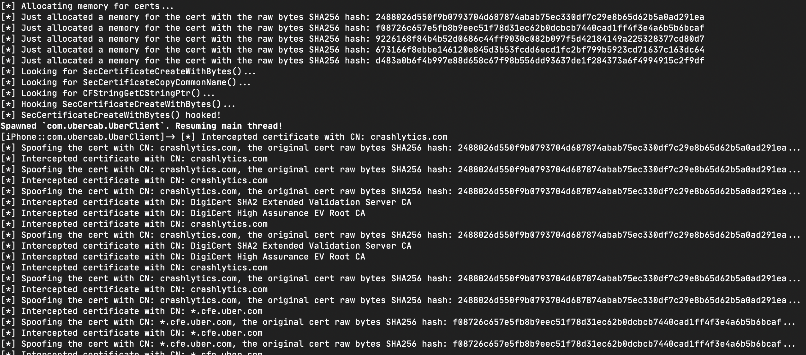
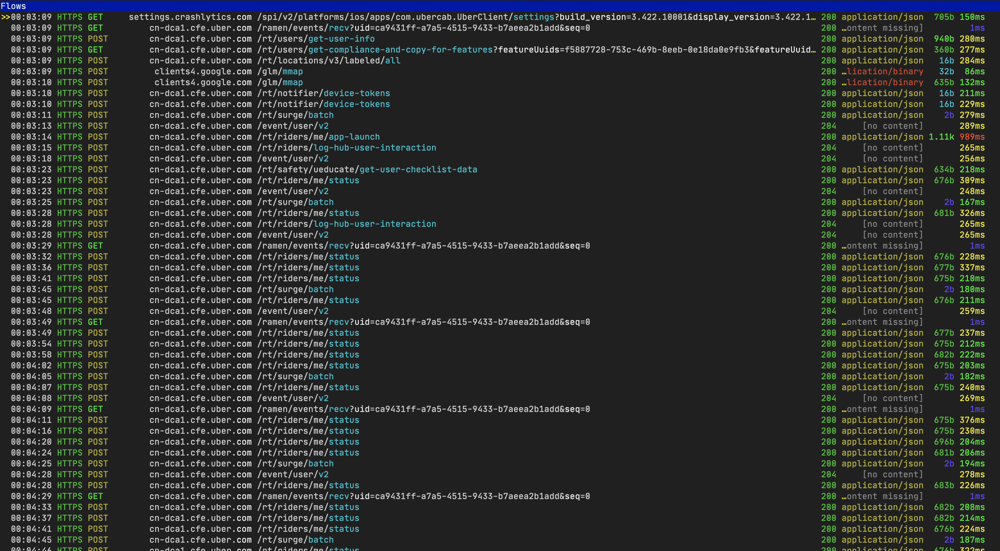

# MEDUZA

"MEDUZA" ("медуза") means "jellyfish" in Ukrainian :ukraine:.





## What is MEDUZA?

It's a [Frida](https://frida.re/)-based tool, my replacement for [SSLKillSwitch](https://github.com/nabla-c0d3/ssl-kill-switch2). I created it for in-house use, but then decided to opensource it. TBH, I hate open source, but the world is full of compromises... :(

## How does it work?

It's simple. First time, you run an app without sniffing and use it as usual. MEDUZA is sitting quietly and collecting certificates used by the app to connect servers. Then MEDUZA generates a Frida script that fakes (==unpin) the collected certificates. So you run the app for second time, use the generated script, and catch the traffic with mitmproxy.

## Limitations

MEDUZA can only unpin apps using iOS system SSL libs. Some apps (e.g. Instagram) do not use the system SSL libs, they implement some third-party custom SSL stack (for example, Instagram uses OpenSSL statically linked to an Instagram private frameworks).

Also, MEDUZA is based on Frida, so it does not work on apps with anti-Frida protection.

## Can I use MEDUZA alongside with other SSL bypass tools, e.g. SSLKillSwitch?

I didn't test it, but MEDUZA employs a different approach than SSLKillSwitch and similar tools, so, theoretically, they should work together without problems. Again, I didn't test it, so I'm not 100% sure. 

## Requirements

- A Mac with MacOS Mojave or later (maybe MEDUZA works on Windows and Linux as well, but it was not tested)

- A jailbroken iOS device (MEDUZA was tested on iPhone SE 2016 with iOS 13.3 and iPhone 6s with iOS 14.0, both are jailbroken with [checkra1n](https://checkra.in/); theoretically, MEDUZA should work with other devices as well, but it was not tested)

- The latest [Frida](https://frida.re/) installed on the Mac and the iOS device.

- [Mitmproxy](https://mitmproxy.org/) installed on the Mac (MEDUZA was not tested with other sniffers like Charles proxy, I'm not sure it will work)

- The Mac and iOS device should be connected with a USB data cable and connected to the same WiFi network.

- Python 3 with [cryptography](https://pypi.org/project/cryptography/) on the Mac (just `pip install cryptography`)

## How to sniff HTTP(s) traffic?

There are two general steps. You need the first step to catch all certificates pinned by an app and generate a script to fake (==unpin) them. You should do it just once at the very beginning, then you can just use the generated script to sniff the traffic. The instruction for the first step:

1. Open Terminal on your Mac and run MEDUZA to list the installed/running apps on your iOS device:

    ```
    $ python3 meduza.py -l
    ```

    The output should look like

    ```
    MEDUZA iOS SSL unpinning tool
    by Dima Kovalenko (@kov4l3nko)
    ============================================================
    
    [*] Waiting for an iOS device connected to USB...
    [*] A list of installed applications:
    	+ Uber (com.ubercab.UberClient) is running, pid=40663
    	- Home (com.apple.Home)
    	- Files (com.apple.DocumentsApp)
    	- Podcasts (com.apple.podcasts)
    	- Contacts (com.apple.MobileAddressBook)
    	- Music (com.apple.Music)
    	- Photos (com.apple.mobileslideshow)
    	- TV (com.apple.tv)
    	+ App Store (com.apple.AppStore) is running, pid=40627
    	- Clock (com.apple.mobiletimer)
    	+ Settings (com.apple.Preferences) is running, pid=40619
    	- TikTok (com.zhiliaoapp.musically)
    	- Watch (com.apple.Bridge)
    	- FaceTime (com.apple.facetime)
    	- Maps (com.apple.Maps)
    	- Voice Memos (com.apple.VoiceMemos)
    	<...etc, you'll see remaining apps here...>
    ```

2. **Important!** Make sure your iOS device WiFi settings are "clear", e.g. no proxy and/or custom router IP specified. On the first step, we **do not try to sniff the traffic**, so the WiFi network connection should be "as usual".

3. Choose the app, e.g. Uber. Run MEDUZA as follows

    ```
    $ python3 meduza.py -s <app name of id> <path/to/the/frida/script.js>
    ```

    e.g.  for Uber

    ```
    $ python3 meduza.py -s com.ubercab.UberClient ./unpinUber.js
    ```

    Here `-s` means that Uber will be (re-)spawned. If you wanna connect to an already running app and do not re-spawn it, use `-a` instead of `-s`.

    As result, you should see something like

    ```
    MEDUZA iOS SSL unpinning tool
    by Dima Kovalenko (@kov4l3nko)
    ============================================================
    
    [*] Waiting for an iOS device connected to USB...
    [*] Spawning com.ubercab.UberClient...
    [*] Attaching to com.ubercab.UberClient...
    [*] Reading JS payload meduza.js...
    [*] Injecting JS payload to the process...
    [*] SecCertificateCreateWithBytes(...) hooked!
    [*] Resuming the application...
    [*] Press ENTER to complete (you can do it anytime)...
    [*] Got another certificate, its raw SHA256 hash: 99b05557bafde776f0afc15bbf6733585b8a03606cbf757158fb96324e01310a
    	crashlytics.com
    	reports.crashlytics.com
    	firebase-settings.crashlytics.com
    	apps-ios.crashlytics.com
    	android-sdk.crashlytics.com
    	api.crashlytics.com
    	settings-api.crashlytics.com
    	download.crashlytics.com
    	distribution-uploads.crashlytics.com
    	cm-us-east-1.crashlytics.com
    	www.crashlytics.com
    	try.crashlytics.com
    	kits.crashlytics.com
    	cm.crashlytics.com
    	apps.crashlytics.com
    	cm-ap-southeast.crashlytics.com
    	settings.crashlytics.com
    	e.crashlytics.com
    [*] Got another certificate, its raw SHA256 hash: 954a9f7dd9f03784bdc5ca9183484a5bfc278ca9ba9f42b3a82f96cffddf277b
    [*] Got another certificate, its raw SHA256 hash: 649a4665273e60b353fe9b4db1807d9669f82cb0ee85bd1e562e7c2f33fdec3a
    	*.cfe.uber.com
    	cfe.uber.com
    	cn-dca1.cfe.uber.com
    [*] Got another certificate, its raw SHA256 hash: eae72eb454bf6c3977ebd289e970b2f5282949190093d0d26f98d0f0d6a9cf17
    <...etc, you can see many messages about certificates, it's ok...>
    ```

4. Do something typical in the app: login, tap some buttons, logoff... e.g. act like an ordinary dumb user :) Every time the app uses a (pinned or not pinned) certificate to connect a server, MEDUZA catches and remembers the certificate.

5. As soon as you complete your monkey-tapping, press `ENTER` in the Terminal. MEDUZA will generate a script (e.g. `./unpinUber.js` in the example above).

The first step is completed. The second step is to use the script:

1. Run `ifconfig | grep "inet "` in your Mac Terminal to see your Mac's IP address.

2. Run Mitmproxy on your Mac

3. On your iOS device, set the Mac's IP and mitmproxy port (`8080` by default) as a proxy for the WiFi connection.

4. Run the generated script with the app. E.g. to (re-)spawn and unpin Uber app, run in Mac Terminal

    ```
    $ frida -U -f com.ubercab.UberClient --no-pause -l ./unpinUber.js
    ```

    See Frida documentation for other options (e.g. to connect already running application).

## How to protect an app from MEDUZA?

There are many ways to do it, e.g.

1. Instagram uses a statically-linked fork of OpenSSL instead of iOS system libs to implement SSL stack. That is why MEDUZA doesn't work on Instagram. 

2. You can add some anti-Frida protection to your app. MEDUZA is based on Frida: if Frida fails, MEDUZA fails as well.

## MEDUZA doesn't work, what to do?

Try to fix it yourself or create an issue. However, I take a look at this GitHub account from time to time ( ==once a year) and support MEDUZA in my spare time ( ==never), so I can't guarantee any support. Welcome to the opensource world ;(
